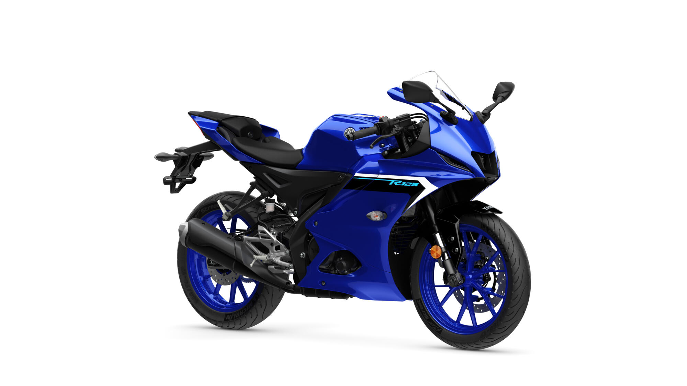
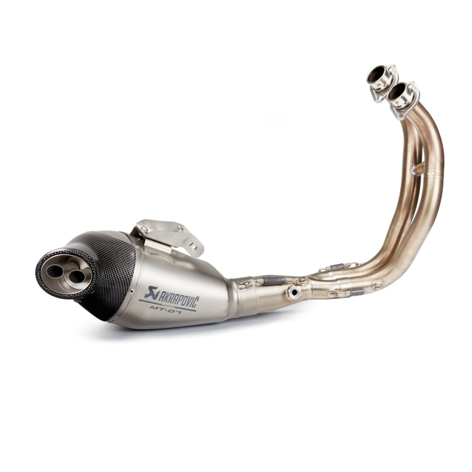

# M293_Yamaha-Webshop

Für die Umsetzung meines Yamaha-Webshops habe ich KI gezielt eingesetzt, um effizient zu entwickeln, mein Wissen im Bereich Webentwicklung zu erweitern und die Benutzeroberfläche intuitiv und modern zu gestalten. KI wurde in folgenden Bereichen eingebunden:

# Einsatzbereiche
## 1. Layout-Design und UI-Optimierung

Bereits zu Beginn des Projekts habe ich ChatGPT und andere KI-Tools zur Ideenfindung für das grundlegende Layout des Webshops eingesetzt. Ziel war es, ein modernes, responsives Design zu entwickeln, das sowohl funktional als auch visuell ansprechend ist.

ChatGPT lieferte Vorschläge für Komponenten. Dies half mir vor allem beim Erstellen des Mockups mit Figma, so konnte ich mir bereits vor der Implementierung Gedanken über den Aufbau der einzelnen Seiten machen.

Cursor ermöglichte es mir, direkt im Code-Editor Feedback zur Benutzerführung einzuholen.

Copilot schlug automatisch Komponenten und Strukturen vor, z. B. für meinen Header oder die Produktkarten.
Diese Vorschläge waren leider nicht immer optimal, sie halfen mir aber, meine eigenen Ideen zu vervollständigen.

## 2. Codegenerierung & Unterstützung

KI unterstütze mich auch wesentlich bei der Codeerstellung/Ressourcenbeschaffung, vor allem bei der Logik mit JavaScript. Ich habe die KI beispielsweise für folgende Aufgaben verwendet:

* Erstellung von JSON-Files für die Motorräder und die Ersatzteile

* Hilfe bei der Implemtierung der Filter/Sortierfunktion in JavaScript

* Konzeptvorstellung für die Integration von Automatisierung (bspw. Wishlist)

* Unterstützung beim Schreiben des CSS-Codes

Die KI diente in diesem Teil nicht als Ersatz für meine Leistung, sondern als Hilfe, um die Arbeit effizienter zu gestalten und die Zeit für die eigentliche Entwicklung aufzusparen. Vor allem bei den Kann-Anforderungen (wie die Slideshow/Animationen generell) unterstützte mich vor allem ChatGPT, indem es mir Vorschläge für die Implementierung der Animationen und die Integration der Slideshow gab.

## 3. Fehlersuche & Optimierung

Im späteren Verlauf des Projekts traten einige technische Herausforderungen auf, z.B. bei der dynamischen Anzeige von Produkten oder beim Zustandmanagement im Warenkorb. ChatGPT half hier durch:

* Vorschläge, den Code aufzuräumen

* Optimierung von Performance-Problemen durch Codeanalyse

* Denkanstoss bezüglich Automation

Bei komplexeren Zusammenhängen zwischen verschiedenen Files griff ich auf DeepSeek zurück. Das Tool half mir, 
Probleme zu erkennen. Eines dieser Probleme war, dass meine HTML-Klasse anderst hiess, als dass ich sie im CSS-File stylen wollte. Die KI hat einen schnellen Überblick über viele Zeilen Code und konnte mir direkt sagen, auf welcher Zeile und in welchem File das Problem liegt. Das hat mir viel Zeit gespart.

# Vergleich der genutzten KI-Tools
## ChatGPT
Vorteile: Ideenfindung und Planung, Vorschläge für Komponenten, Überprüfung auf Fehler oder Verbesserungspotenzial

Nachteile: Bei viel Code schnell verwirrt, kann halluzinieren, erkennt komplexe Zusammenhänge nicht immer, zum Teil wurden Prompt-Stellen einfach ausgelassen, Nachrichtenlimit, eher stark im Backend als im Frontend

## Deepseek
Vorteile: Schnelle Fehlererkennung und Analyse, erkennt Muster und Zusammenhänge schnell, kann lange Prompts gut auswerten, weniger "unnötige" Nebeninfos, kennt viele Sprachen

Nachteile: Eher rational, weniger kreativ, keine präzisen Erklärungen von Code ohne Nachfragen, Prompt muss sehr genau sein, Server schnell ausgelastet

## Cursor AI
Vorteile: Direkte Integration im Code, Versionskontrolle und einfaches Rückgängigmachen von Änderungen, Umstrukturierung von Code, erkennt Zusammenhänge effizient, stark in vielen Sprachen

Nachteile: (Zu) viele Funktionen (sogar bei kostenloser Nutzung), braucht viel RAM bei grösseren Änderungen, deutsche Übersetzung etwas fragwürdig

## Copilot
Vorteile: Direkte Integration im Code, Automatische Vervolständigungsvorschläge für Code und Text, kann einfache Muster erkennen

Nachteile: Zum Teil komische Vorschläge, erkennt keine komplexen Zusammenhänge, Erklärungsfunktion noch nicht vollständig ausgereift

Ich habe zu Beginn hauptsächlich ChatGPT verwendet, insbesondere für die Strukturierung und Planung des Projekts und dem Aufbau. Bei der Planung habe ich mich zuerst darüber informiert, welche Optionen ich habe, um meine Daten zu integrieren, ohne sie hardzucodieren. ChatGPT hat mir den Vorschlag eines JSON-Files mit dynamischem Laden durch JS-Code gemacht, was ich auch so umgesetzt habe. Bei schwierigen Problemen, wo ChatGPT und auch das Internet mir nicht mehr helfen konnten, setzte ich DeepSeek ein. Mit diesen beiden Tools habe ich Erfahrung und ich weiss, dass DeepSeek vor allem im Erkennen von komplexen Zusammenhängen sehr stark ist. Cursor habe ich vorhin noch nicht gekannt. Ein klarer Vorteil dieses Tools ist die direkte Integration in den Code, was ich auch bei Copilot gesehen habe, bei Cursor meiner Meinung nach jedoch besser funktioniert. Copilot unterstützte mich Codemässig in diesem Projekt weniger. Einzig am Anfang, also bei der Erstellung der Projektstruktur, halfen mir die Autokorrekturen.

Auch spannend: Die beste Erfahrung habe ich damit gemacht, meine Prompts auf Englisch zu verfassen. Zudem half es mir, meine Klassennamen selbsterklärend zu machen, sodass die KI schon nach dem ersten Blick wissen kann, was ich meine. Das hat mir viel Zeit gespart.

# Einige Prompts und deren Resultate 
## Prompt an ChatGPT:

    "I'm building a performance optimized, fully accessible webshot without any frameworks, using semantic HTML, modern CSS and some JS only. The homepage needs to display a starting page with product categories (spare parts and motorcycles in a lideshow), new products and a newsletter subscription form. The product site should consist of dynamic product-cards. If you klick on the card, you will be directed to the detailed page. Last page should consist of team members photos, a short text about us and a contact form. Could you provide a clean, yamaha-themed, semantic HTML5 structure for the named pages, emphasizing accessibility and progressive enhancement? No 
 elements unless absolutely necessary."

### Resultat:

    "Certainly. Below is a semantic, accessible HTML5 structure for the Yamaha Webshop homepage. It preserves your site’s structure and functionality but replaces layout-oriented 
s with semantic elements like <section>, <nav>, <article>, and so on. Any remaining 
s are justified by layout neutrality or ARIA roles.

    <!DOCTYPE html>
    <html lang="en">
    <head>
    <meta charset="UTF-8" />
    <meta name="viewport" content="width=device-width, initial-scale=1.0"/>
    <title>Yamaha Webshop – Home</title>
    <link rel="stylesheet" href="styles.css" />
    </head>
    <body>
    <header role="banner">
        

        <nav aria-label="Main navigation">
        <ul>
            <li><a href="index.html">Home</a></li>
            <li><a href="products.html">Products</a></li>
            <li><a href="contact.html">About Us</a></li>
        </ul>
        </nav>

        

        
        
        

        <button class="burger-menu" aria-label="Toggle navigation menu">
        
        </button>
    </header>

    <main>
        <section aria-labelledby="featured-categories">
        <h2 id="featured-categories" class="visually-hidden">Product Categories</h2>

        <figure>
            
            <figcaption>
            <a href="products.html#bikes">See More – Bikes</a>
            </figcaption>
        </figure>

        <figure>
            
            <figcaption>
            <a href="products.html#spareparts">See More – Spare Parts</a>
            </figcaption>
        </figure>
        </section>

        <section id="new-products" aria-labelledby="hot-products">
        <h2 id="hot-products">Hot Products</h2>
        <ul class="product-grid">
            <li>
            <article>
                
                <h3>Tinted Windshield</h3>
            </article>
            </li>
            <li>
            <article>
                
                <h3>Yamaha MT-07 2020</h3>
            </article>
            </li>
            <li>
            <article>
                
                <h3>Yamaha R125 2025</h3>
            </article>
            </li>
            <li>
            <article>
                
                <h3>Akrapovic Full Exhaust System</h3>
            </article>
            </li>
        </ul>
        
<a href="products.html" class="see-more-btn">See More Products</a>

        </section>

        <section id="newsletter" aria-labelledby="newsletter-heading">
        <h2 id="newsletter-heading">Subscribe to Our Newsletter</h2>
        <form action="/subscribe" method="post">
            <label for="name">Name:</label>
            <input type="text" id="name" name="name" required />

            <label for="email">Email:</label>
            <input type="email" id="email" name="email" required />

            <button type="submit">Subscribe</button>
        </form>
        </section>
    </main>

    <footer role="contentinfo">
        <nav aria-label="Footer navigation">
        <ul>
            <li><a href="contact.html">Contact</a></li>
            <li><a href="imprint.html">Imprint</a></li>
            <li><a href="products.html">Products</a></li>
            <li><a href="contact.html">About</a></li>
        </ul>
        </nav>
        
&copy; 2025 Yamaha Webshop

    </footer>
    </body>
    </html>"

Dieses Ergebnis konnte ich als Basis gut verwenden, da es schon einige Komponente enthielt, die meiner Vorstellung entsprachen. Ich habe jedoch einige Änderungen und Ergänzungen vorgenommen, um es meinen Anforderungen anzupassen.

## Prompt an DeepSeek:
    "I'm trying to load product data from a JSON file into my JavaScript app, but nothing shows up on the page. I think the script is running, but the product cards never render. Here's the relevant part of my JS-code:

    document.addEventListener('DOMContentLoaded', () => {
    Promise.all([
        fetch('products/motorcycles.json').then(res => res.json()),
        fetch('products/spareparts.json').then(res => res.json())
    ])
    .then(([motorcyclesData, sparepartsData]) => {
        let motorcycles = [...motorcyclesData, ...sparepartsData];
        renderCards(); // should show all products
    });
    });

    function renderCards() {
    const container = document.getElementById('card-container');
    container.innerHTML = '
Rendering cards...
'; // for testing
    // ... rest of code that builds the cards
    }

    My spareparts.json looks like this:

    [
    {
        "id": "sp1",
        "name": "Tinted Windshield",
        "image": "images/windshield.png",
        "price": 129.99,
        "category": "spare"
    }
    ]

    There are no errors in the console. Any ideas?"

### Resultat:

    "You're on the right track, and thanks for providing the snippet and JSON – that helps a lot!

    Here are a few steps to diagnose and likely fix the issue:
    🔍 1. Scope issue with motorcycles

    You're declaring motorcycles inside the .then() block using let. But in renderCards(), you're trying to access it from outside that scope. So renderCards() sees an empty or undefined version of motorcycles.

    ✅ Fix:
    Declare motorcycles outside the async block, so it's available globally:

    let motorcycles = [];

    document.addEventListener('DOMContentLoaded', () => {
    Promise.all([
        fetch('products/motorcycles.json').then(res => res.json()),
        fetch('products/spareparts.json').then(res => res.json())
    ])
    .then(([motorcyclesData, sparepartsData]) => {
        motorcycles = [...motorcyclesData, ...sparepartsData]; // assign to outer scope
        renderCards();
    });
    });

    🧪 2. Make sure #card-container exists

    Double-check that your HTML has a container like:

    

    If this is missing, your renderCards() function would silently do nothing.
    🧱 3. Check if renderCards() builds cards correctly

    You mentioned it only shows the test text "Rendering cards...". Try logging the actual data:

    console.log('Motorcycles:', motorcycles);

    If this logs correctly, then the card creation logic might be the problem (e.g., broken innerHTML template or missing moto.image etc.).
    ✅ Summary

        Move the motorcycles variable outside the .then() to make it accessible globally.

        Ensure #card-container exists in your HTML.

        Add console.log inside renderCards() to debug what’s actually being rendered.

    Let me know what you find and I can help further!
    💡 Bonus Tip

    Wrap your fetch() calls with error checks – a bad path or malformed JSON won’t throw an error directly:

    fetch('products/spareparts.json')
    .then(res => {
        if (!res.ok) throw new Error('Network error');
        return res.json();
    })

    This helps avoid silent failures when the file isn't found or has a typo."

Dieses Resultat hebt die Problemlösefähigkeit von DeepSeek hervor. Während ChatGPT keinen funktionierenden Code bereitstellen konnte und den Zustand des Codes eher verschlimmbesserte, erkannte DeepSeek das Problem direkt.

# Fazit und Reflexion

Die Integration von KI-Tools hat meine Arbeitsweise grundlegend verändert. Statt ausschließlich selbst nach Lösungen zu suchen oder Tutorials zu durchforsten, konnte ich durch gezielte Prompts sofort fundierte Hilfe erhalten. Besonders hervorzuheben ist der Wert der KIs als Tutor. So habe ich nicht nur Code bekommen, sondern die Konzepte dahinter verstanden. Die Tools haben mir viel Zeit gespart, vor allem in der Problembehebnung. Durch die Differenzierung zwischen KI als Ersatz und KI als Hilfe konnte ich die im Modul vermittelten Lerninhalte selbst begreifen und trotzdem von den Qualitäten einer KI profitieren.

Insgesamt konnte ich durch die KI:

* schneller und strukturierter entwickeln

* häufiger Varianten ausprobieren (da ich mehr Zeit hatte)

* Fehler schneller beheben

* mein Wissen deutlich vertiefen

Ich habe gelernt, dass KI kein Ersatz für eigene Kreativität ist, sondern ein Werkzeug, das mir hilft, bessere Ergebnisse in kürzerer Zeit zu erzielen. Besonders in Kombination mit eigenständigem Denken, Kritikfähigkeit und einem klaren Ziel vor Augen habe ich das gelernt und mein eigenes Potenzial vollständig ausgeschöpft.